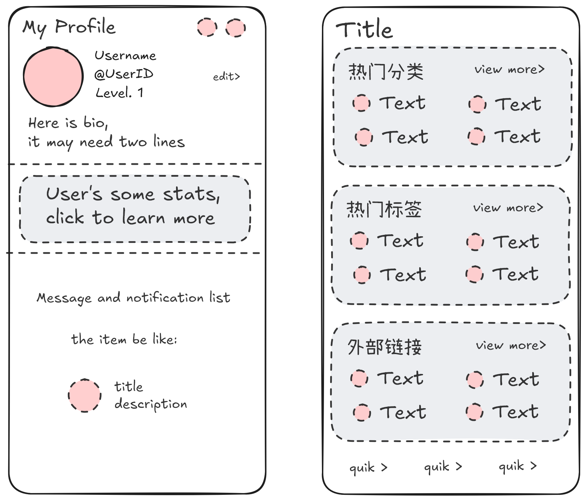

# **L**inux.do **U**nofficial **M**obile **A**pp


A TypeScript client for interacting with the Linux.do Discourse platform, built with React Native.

TODO:

- Current file generated by AI, needs to be edited
- Modify color scheme
- Add custom features

The UI of Navigation and User screens generated by AI used follower image


<!--
## ✨ Features

-  -->

## 🛠 Tech Stack

- **Language**: TypeScript
- **HTTP Client**: Axios (with tough-cookie)
- **UI Framework**: React Native Reusables and nativewind v4

## Deployment

### Install dependencies

```bash
pnpm i
```

### Start the app

```bash
pnpm start
```

### Format & Lint

```bash
pnpm check
```

<!-- ## 🧩 Code Structure

```
luma/
├── components/
│   └── ui/           # Reusable React components
├── lib/
│   ├── api/          # Generated API client
│   └── gen/          # TypeScript API schemas
└── docs/             # Documentation
``` -->
